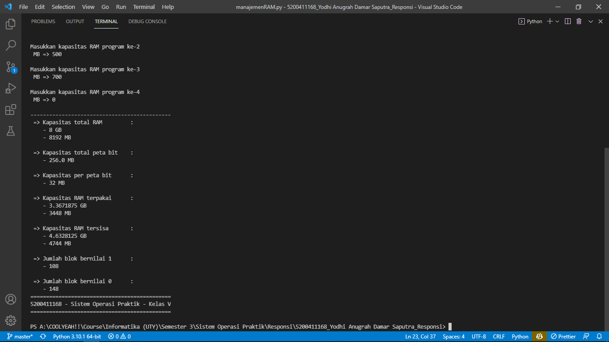

<h1> RESPONSI   SISTEM OPERASI PRAKTIK   KELOMPOK V </h1>

Yodhi Anugrah Damar Saputra - 5200411168

 
 

## 1. Manajemen RAM

Sistem melakukan manajemen pemakaian RAM terhadap kapasitas sistem operasi serta program berjalan

### Sistem akan meminta _input_ berupa:
* Kapasitas total RAM
* Total peta bit
* Kapasitas RAM yang digunakan oleh sistem operasi
* Kapasitas RAM yang digunakan oleh program

### Sistem akan menghasilkan _output_ berupa:
* Kapasitas total RAM
* Kapasitas total peta bit
* Kapasitas per peta bit
* Total kapasitas RAM yang terpakai
* Total kapasitas RAM yang tidak terpakai
* Jumlah blok yang bernilai 1
* Jumlah blok yang bernilai 0

> [Manajemen RAM](manajemenRAM.py)

 

## 2. Penjadwalan Round Robin

Sistem mengerjakan penjadwalan program yang berpatokan pada _quantum time_ dalam selama _burst time_

### Program akan meminta _input_ berupa:
* Nama program serta _burst time_ program tersebut
* _Quantum time_

### Program akan menghasilkan _output_ berupa:
* Nama program serta _burst time_ masing-masing program 
* Total program masuk
* Total _burst time_ seluruh program
* _Quantum time_
* Urutan penjadwalan
* Durasi masing-masing program berjalan
* Sisa _burst time_ masing-masing program
* Sisa total _burst time_ seluruh program

> [Penjadwalan Round Robin](penjadwalanRoundRobin.py)

 

----------

# Screenshot

## 1. Manajemen RAM

* ### Hasil running manajemen RAM (berhasil)

* ### Hasil running manajemen RAM (gagal)

 

## 1. Penjadwalan RoundRobin

* ### Hasil running manajemen RAM (berhasil)

* ### Hasil running manajemen RAM (gagal)

----------

 
 

Universitas Teknologi Yogyakarta - Fakultas Sains dan Teknologi - Sarjana Informatika - 2021

